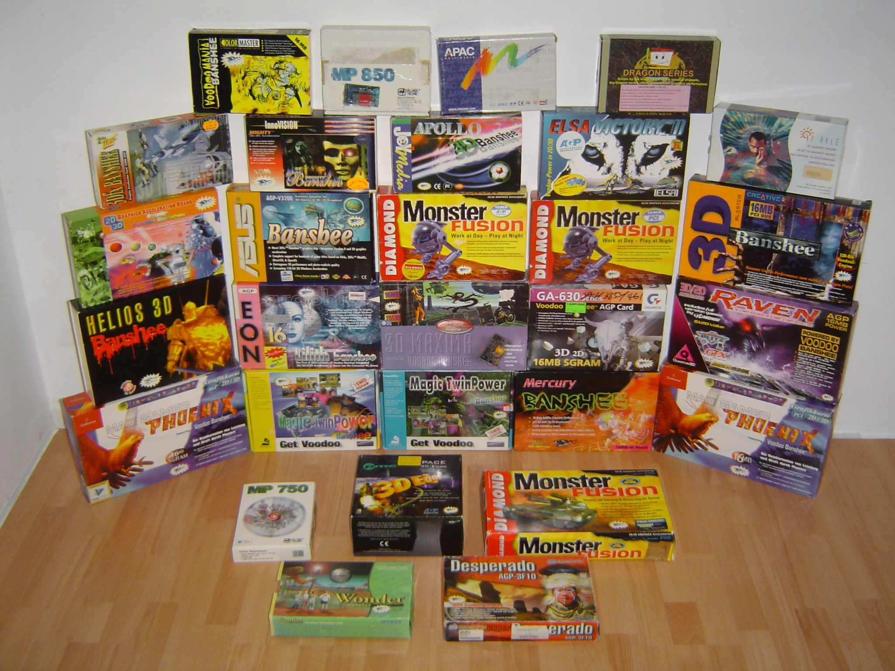
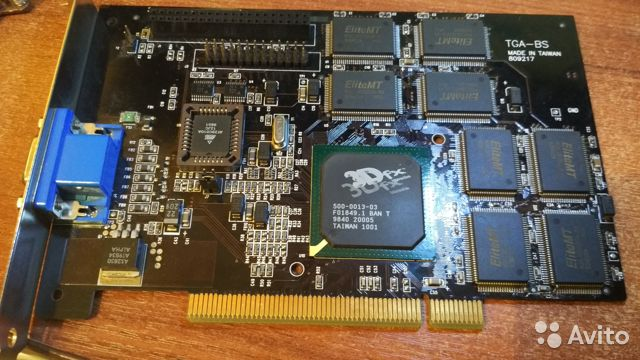

# Ingeniero Informático de Coraje
#### banshee - 2020

## Parte I - Sueño, Oportunidad e Ignorancia

Es el año 1998, el *Pentium II* esta en su apogeo, la memoria *SDRAM* lo alimenta correctamente y el bus *AGP* está totalmente asentado. Pero todo esto yo no lo sabia ...

A finales del 98 mis únicos contactos con la informática eran el cine y el *80486* del hermano de unos amigos que esporádicamente, en modo espectador, contemplaba mientras ellos escribían texto sobre una pantalla negra y aparecian juegos de unos gusanos en una interminable guerra o se convertian en hombres de negocios respetables mediante la gerencia de una agencia de transportes. Impresionante y lejano para mi. Me contentaría durante años con emular mediante mi imaginación y el tablero de un juego de mesa, el cual abría a modo de portátil en mi escritorio con bandeja para teclado, que manejaba una de estas futuristas máquinas.

Octubre de 1998, la caja de ahorros de toda la vida de mis padres, publicitó una serie de "ofertas" (volveremos sobre ésto) permitiendo comprar a plazos un ordenador personal. Tres modelos partiendo de un precio mínimo alrededor de 300.0000 pesetas de la época (1800 euros). Mis padres, con esfuerzo y buena voluntad pensaron que era la oportunidad perfecta para iniciarme en el mundo de la tecnología y me propusieron su compra. *¿Qué te parece si te compramos un ordenador ...?*.  Si hubiera tenido pajarita, habría salido volando. *J\*\*\*r si!*

Perdí la cuenta de las veces que pude releer el genérico folleto hasta que lo trajeron a casa. Potente procesador de *300Mhz*, *32 MB RAM*, *CDROM 32x*, impresora a color, *Windows 98* y un completísimo paquete de software. Y llegó el dia. **10 de Noviembre de 1998**. He llegado a olvidarme de la fecha del cumpleaños de mi hermano, pero no de ésta. No es para estar orgulloso, pero es un hecho. Lucía flamante. Nada que ver con el amarillento PC del hermano de mis amigos. Semitorre blanca, monitor CRT con altavoces integrados, impresora de inyeccion, y por fin, el tablero del juego de mesa ocupó su lugar en la estantería, dejando su hueco para un teclado de verdad. La revolución en mi vida estaba a punto de comenzar.

 

Totalmente maravillado ante esa interfaz gráfica, colorida e intuitiva. Ningun parecido con aquella mística pantalla negra de letras blancas. Menús, ventanas, y hasta un clip que parecía saber manejar este cotarro mucho mejor que yo. Pero faltaba algo, yo quería aquellos juegos que habia visto tiempo atrás. Sabía de la existencia de otros mas modernos, mi PC incluso traía alguno y ya me había quedado perplejo ante un arcaico simulador de fútbol 3D. Sin embargo, tantas veces los había emulado desde mi portátil de cartón, que ahora al fin podía. Una llamada de teléfono y en lo que arrancaba *Windows98* mis amigos estaban en la puerta de mi casa con una caja de *diskettes* y *CDROMs* de caras azules.

Como si fuera Neo, los *diskettes* entraban y salían mientras yo pedía mas y mas. Curiosamente hubo que apagar y encender de nuevo el ordenador sobre esa extraña pantalla negra. Nada que una libreta en la que apuntar los comandos para lanzar los juegos no pudiera solucionar. En cuestión de horas tenía mi PC repleto de software adicional, preparado para meses de aventuras. No podía imaginar cómo de acertadas iban a ser estas palabras.

Nuevo juguete en casa y todos queriamos usarlo. Tocaba volver a *Windows*, pero tamaña sorpresa cuando una araña ocupando la pantalla nos dejó con un sudor frio recorriendo la espalda y sin poder arrancar el PC ...

\
*... continuará en parte II*

  

## Parte II - Cruda Realidad y Ayuda Internacional

Y con cara de tontos nos quedamos mirando una pantalla que parecía salida de una película mala de *hackers*. Por mas veces que aplicáramos la solución por antonomasia en este gremio, el arácnido de cara hostil aparecía tras cada intento de arranque. Con una bochornosa vergüenza, una conversación algo tensa con mi padre y ostentando el record mundial del menor tiempo en romper el aparato mas nuevo y caro de la casa, llamé de nuevo mis amigos con la esperanza que todo fuera un mal y breve recuerdo. Una tarde de sudor y promesas de que en breve todo estaría solucionado. Al menos, el problema estaba claro, los ordenadores podían enfermar... primera noticia. Si un disco fue el problema, otro parecía ser la solución. Muchos nuevos conceptos y alguna vaga explicación en una tarde de desilusiones. *Modo MS-DOS*, *antivirus*, *disco de arranque*, *tabulador*... conceptos que se acercaban al idioma oriental en aquellos momentos. Se fueron igual que llegaron pero con el compromiso de que su hermano lo solucionaría todo en un abrir y cerrar de ojos. 

Dias de idas y venidas, de largas tardes y palabras extrañas que a base repetición, empezaban a sonar familiares. El punto de inflexión y la solución final había llegado. *Formatear* era la definición de "volver a dejar el ordenador como recién comprado". ¡Haberlo dicho antes!. En apenas una hora la instalación de *Windows 98* estaba finalizando y el nudo en el estómago de la última semana se iba aflojando.

Y funcionó ... o casi. El ordenador arrancaba pero en una limitada gama cromática de 16 colores e iconos del tamaño de monedas de 500 pesetas. Que no cundiera el pánico, era algo normal, tan solo habia que instalar algo conocido como **driver**. Esto le decía a *Windows* exáctamente que piezas eran las que tenia el *PC* y podría hacerlas funcionar corréctamente. Estos *drivers* habitualmente venian en la colección de *CD-ROMs* que acompañaban a todo ordenador. Eran fáciles de identificar porque cada uno especificaba la marca y modelo del componente. Extráñamente yo solo tenía 2 discos con el logotipo de la marca del PC y donde no parecian estar esas piezas de *software*.

 

Como recordaré algunas veces mas a lo largo de esta historia, eran tiempos en los que internet no era algo habitual donde poder buscar información, o descargar *controladores*. Cada posible solución se dilataba dias en el tiempo hasta que alguien con mas conocimentos pudiera indicar el camino a seguir.

Tiempos de espera que ocupaba en **MS-DOS**, el cual no precisaba de esos *drivers*. Con cierto orden y una libreta que se iba llenando de comandos y atajos de teclado, pasaban las semanas. *Comandante Norton*, *C:*, *arj*, *Mortal Kombat*, mis conocimientos crecian pero la paciencia de mi padre se agotaba. Llegó el momento de **llamar a garantia**.

El servicio técnico se encontraba en **Holanda**, aunque por suerte, en castellano. Tras múltiples llamadas y explicaciones al nivel de preguntar por qué parecia que el problema estaba en la torre, cuando era el monitor lo que se veia de manera incorrecta, dejamos clara nuestra inexperiencia. Aun así conseguimos transmitirle el estado de la máquina. Al parecer, no pudimos intentar resolver el problema de peor manera. Lo que ahora es común, en  1998 era una técnica novedosa. En lugar de suministrar un disco con el *Sistema Operativo*, los *drivers* por separado, y cada una de las aplicaciones del paquete de *Software* en un medio independiente, el fabricante distribuía dos discos que lo integraban todo y facilitaban la instalación para un usuario sin experiencia. Para que este *software* solo pudiera instalarse en el *PC* sobre el que había sido adquirido, la información se encontraba encriptada y solo una pequeña porción de *software* presente en el disco duro permitía la instalación de estos discos. Información que se perdió al formatear manualmente el disco duro. Esto fué el precursor de las particiones de *Recovery* que hoy en dia integran la práctica totalidad del mercado de portátiles con *sistema operativo* preinstalado, pero adecuado a las bajas capacidades las unidades de disco de la época. 

Facturas de teléfono internacional astronómicas, semanas de espera de *diskettes* que **"tatuarian"** el disco duro para que fuera reconocido de nuevo por este sistema de recuperación. Largas tardes donde los *comandos* de mi libreta crecían. *Sistema de Ficheros*, *Partición*, *Sector de Arranque*, *FAT* ... Y por fin, tras varios envíos de *diskettes* turquesas el *PC* lució como el primer dia. *Windows 98* arrancó con 16 bits de profundidad de color, enciclopédia *Salvat Multimedia*, *Virtua Soccer 2* e incluso símbolos de *Nike* diseñados en *Paint* y carátulas de discos mediante *WordArt* pasaban por el cartucho de tinta con cabezal integrado de la flamante impresora *Canon*.

Por fin parecía que habíamos vuelto al primer dia, sin embargo algo en mi **ya** había cambiado para siempre ...

## Parte III - El Pastel

Pasaron dias y meses empapándome cual esponja los entresijos de *Windows 98*. Después de una temporada haciendo mi dia a dia con *Comandante Norton*, manejarme en este entorno visual se hacia bastante intuitivo. La enciclopedia *Larousse* de *Circulo de Lectores* por catálogo que tantos años habia tardado en coleccionar, de repente parecía obsoleta ante la versión electrónica de *Salvat*. Audios, videos y la capacidad de saltar de un artículo a otro hacian sentir que todo el conocimiento del mundo estaba bajo la yema de mis dedos en apenas los diez segundos que tardaba el *CD-ROM* de *32X* en despegar y leer la información necesaria. Mucho me quedaba aun por ver ante la revolución de *Internet* que estaba por llegar.

Aprendí las bases de la ofimática de la mano de *Word 97*, perfeccioné mis dotes de diseño en *Paint* o *Corel Draw* y reproducí mis primeras pistas de música sin necesidad de insertar ningun disco en el lector con el programa de curiosa interfaz que daría guerra durante años por su extensa personalización. Usaria *Winamp* durante mas de una década hasta la implantación del *streaming*.

Época de nuevas amistades que compartiamos una misma pasión. Quizás fuera mi percepción o en ese preciso momento la informática estaba sufriendo una revolución como nunca vista. Aunque con cierto retraso, llegaba a mis manos todo tipo de *software* y *videojuegos*, que instalaba con cierto rigor y previo paso por diversos *antivirus* a tenor de mi dilatada experiencia con el *malware*. *Quake 2*, *Tomb Raider*, *Virtua Cops*, *Commandos*, *Moto Racer* y un sin fin de obras con las que dejé de ver la luz del sol y tantos castigos me costaron. Me sentía en la cresta de la ola, el rey del mundo virtual pilotando un *Aston Martin* pagado a plazos de la computación. Poco tardaría en darme cuenta que la marca de mi vehículo estaba mas próximo a un *Seat* de segunda mano.

*Colin McRae Rally* y *Resident Evil* hicieron que descendiera de la nube en la que me encontraba. Daba igual las veces que reiniciara y reinstalara. Iconos de error, códigos inteligibles y un humillante sonido aparecían una y otra vez. Nunca sabré si el deseo desmedido por estos juegos se debió a la imposibilidad de poder ejecutarlos o a un favoritismo real, pero me fue imposible descartarlos sin mas. 

Un proceso de investigación que a dia de hoy no llevaría mas de 20 segundos transcribir en *Google*, pero que duró meses. Revisar todas y cada de las opciones de configuración de *Windows*, sondeo de conocidos, compra de revistas como *PC Actual*, *PC Plus* o *Computer Hoy* con la esperanza de que oculta entre sus páginas pudiera encontrar **la respuesta**. Leí y releí aquellas páginas de principio a fin. Aprendí la diferencia entre *software* y *hardware*, trucos para hacer tu equipo mas eficiente, como *desfragmentar* tu disco duro, instalar nuevos *Themes* para *Windows*, como recuperar la información de un disco duro tras un incendio y una larga lista de curiosidades y conceptos con el *Diccionario de Informática* en tres volúmenes que mes tras mes adquiría como complemento. Pero todos estos nuevos conocimientos de nada parecian servir. Tuve que conformarme con la silla auxiliar viendo *Resident Evil* en el nuevo ordenador de mis amigos como si de una película se tratase, y jugar *Colin McRae Rally* en teclado compartido. Aunque poco podia competir si cuando yo regresaba a casa ellos podían seguir practicando. Quizás por esto entiendo las limitaciones en los entrenamientos privados para la *Formula 1* actual.

Como siempre por entonces, la respuesta vino del hermano mayor de mis amigos, que comenzó a trabajar en una las tiendas de Informática que tanto proliferaron a comienzos de los años 2000. Mi problema era la **Tarjeta Gráfica**. Una placa de circuito impreso que se encontraba en el interior de la torre, la cual era posible sustituir en pocos minutos. Sin embargo, mi *PC* contaba con una gráfica integrada en la *placa base* con unas casi nulas capacidades 3D y sin memoria propia. El mercado era amplio y variado en cuanto a precios y características como podia comprobar en las páginas finales de mis revistas que incluian extensos listados de componentes y precios. Por suerte, para ejecutar con una mínima calidad no necesitaba la mejor de las **aceleradoras 3D** posibles. Una modesta *Intel 740* como las que comencé a identificar en los PCs de mis amigos era suficiente y su precio rondaba las *5000 pesetas*. Unos cuantos meses ahorrando *la paga* y algún que otro *chanchullo* me bastó para plantarme en mi tienda de informatica de confianza semitorre en mano. Por fin despues de tanto tiempo de investigación y espectación volvería a tener un PC a la última. No podia imaginar que se avecinaba otro desengaño mas.

 

Al parecer era imposible instalar no solo la reservada *Intel 740*, sino casi cualquier tarjeta gráfica actual. Mi placa base no contaba con ranura **AGP** que era el estandard actual. ¿Cómo podia ser eso posible?. No es que el PC no fuera nuevo, es que aun quedaban **años** para completar su pago financiado. Pero el problema era incluso mas profundo. Si el todo radicaba en la placa base, ¿cuánto costaba cambiarla por otra con ese puerto de aceleración gráfico?. Y ahi fue cuando descubrimos el **gran pastel** que fue esta compra. No existian placas base con puerto *AGP* que fueran capaces de reutilizar el resto de componentes. Cambiar la placa base, implicaria cambiar tambien el procesador. Mientras el estandard actual era el **Slot A** de *Intel* para **Pentium II** y **Celeron** o el **Super Socket 7** para sus cohetáneos de **AMD**. Mi placa base contaba con un **Socket 7**, montando un desconocido procesador *Intel compatible* **Cyrix M2**. Un procesador de una generación anterior en completa descatalogación y desuso. Para colmo, aun siendo un modelo capaz de funcionar a *300 Mhz*, esta placa no la dejaba pasar de los *266 Mhz*. Ni siquiera la *memoria RAM* era aprovechable. Mientras todas las placas base actuales utilizaban **SD-RAM**, mi placa montaba 32MB de memoria **EDO-RAM**, un formato tan obsoleto como el resto de componentes y con la totalidad de zócalos ocupados, con lo que tampoco sería posible su ampliación en un futuro e incluso presente que empezaba a mostrarse limitado con un continuo y desesperante *swapeo*.

En definitiva, incorporar un puerto *AGP* implicaba adquirir una nueva *placa base*, y con ella, *procesador*, *memoria RAM*, y probablemente ni siquiera la caja pudiera alojarlas. En definitiva un *PC* completamente nuevo. Tardamos tiempo en asimilarlo. Nuestra caja de ahorros puso a la venta ordenadores de una generación anterior a precios de **mas del doble** de lo que se podia adquirir uno actual en cualquier establecimiento. Una estrategia totalmente **abusiva** y que se aprovechó del desconocimiento y los recursos de muchas familias condenadas a cumplir el inflado pago de *hardware* desfasado. Un negocio rendondo para dar salida a *stock* obsoleto por parte de los fabricantes. Una campaña plagada de desinformación y en mi opinión de **tácticas desleales** para sus clientes de toda la vida. Nunca mas confié en bancos ni departamentos comerciales. La *autoformación* y foros de opinión fueron mi medio habitual desde que estuvieron disponibles.

En tal desolador panorama aun había una mínima **esperanza**. Como últimos coletazos de la anterior generación **PCI** y según los catálogos ofertaban, existía una reducida colección de aceleradoras gráficas tope de gama en formato *PCI* del que si disponia mi placa base. Productos de renombre como *3D Blaster*, *Matrox*, *Diamond*, *Guillemot* ... que superaban en **6 veces** el presupuesto inicial. Era la única opción. Tocaba esperar y ahorrar mientras escupía el veneno del ponzoñoso pastel que con la mejor de las caras los señores de traje y corbata nos habian metido hasta nuestra propia cocina.

Una vez mas no sería tan fácil ...

## Parte IV - Búsqueda y Desesperación.

Durante varios meses entré en modo ahorro. Pagas, visitas a abuelos, encargos de dudosa legalidad e incluso hambre, guardando el dinero del bocadillo del instituto y pasando el día a base de mendigar bocados a unos y otros. Como si de un programa de recaudación de la TV se tratara, había conseguido el objetivo para salvarme de la obsolescencia intencionada en la que se encontraba mi *PC*. Con 32.000 pesetas que quemaban en mi pequeña caja fuerte azul podía elegir casi cualquiera de las tarjetas aceleradoras **PCI** que aparecían en los mas selectos catálogos de revistas especializadas.

Lejos quedaba aún *Amazon*, *PCComponentes* o *Ebay* en una época analógica en lo que a compra y distribución de *hardware* se refiere. Pedaleé tan rápido como pude en mi vieja bicicleta verde y blanca (curiósamente adquirida en la misma caja de ahorros que el ordenador) a mi tienda de informática de confianza. Rebosante de ilusión e impaciencia, pues bastante había tenido ya, encargué mi tarjeta *PCI*. Tan solo restaba esperar hasta el próximo Martes, dia de entrega de todos los encargos en esta pequeña tienda local. Semana durante la cual, la emoción se tornaba paranoia. Cual mantra contaba los días, repitiendo en mi cabeza *- mañana podré decir...mañana podré decir mañana*, *- mañana podré decir mañana*, *- hoy puedo decir mañana*, *- hoy es el dia*. Tras una noche imaginando el momento, una mañana de instituto distraída e incluso felicitaciones de mis amigos, estaba en la puerta de la tienda antes de que levantara la persiana. El encargado pasa a la trastienda, mientras yo espero que salga tras una nube de humo con mi ansiada tarjeta en las manos. Pero la burbuja estalló.

La aceleradora no había llegado en el pedido. La reclamaría y para el Martes siguiente la tendría. Y le creí. Durante otra semana interminable recitando mi mantra, el resultado fue el mismo. Y la siguiente. Decidí entonces no esperar mas y coquetear con otros proveedores. Me parecía una faena encargar varias y luego solo recoger una, pero me perdonen los minoristas locales, estaba desesperado. Cada tienda comprobaba su catálogo y confirmaba la existencia de *stock* ante mi inusitada insistencia de algún modelo en formato *PCI*. Llegué a conocer la fecha y hora de reparto de cada proveedor logístico de todas las tiendas de informática de mi ciudad. El resultado fue el mismo en todas. Al paso de semanas iban confirmando la descatalogación de estas tarjetas de generación anterior o me mantenían en una interminable espera.

Se acabó hacer el tonto. Conseguí convencer a mi padre para ir directamente a la fuente. Un viaje a Málaga y adquiriría mi ansiado producto directamente de la estantería de *El Corte Inglés* o alguna otra gran superficie. Me imaginaba recorriendo los pasillos de informática del centro comercial, y ver un brillo especial emanando de las sección de tarjetas gráficas. Agarraría la mía con fuerza y la metería en el coche parapetada entre cojines para llevarla a su nuevo hogar. Sin embargo, no fue así. Parecía un mal sueño, de esos que no puedes despertar, pero era real. Volví de Málaga con las manos vacías. En ningún sitio quedaba ni un solo ejemplar *PCI*.

Mi ilusión y esperanzas se fueron diluyendo con el paso de las semanas y los meses. No así mi afición a la informática y videojuegos, pero obviamente limitada y recelosa. El dinero fue esfumándose poco a poco en otras caras aficiones (habrá quien las llame adicciones). *Warhammer*, *Magics*, *Dungeons & Dragons* ... la oferta era amplia para un *freak* de 15 años.
El universo de la aceleración 3D permaneció enterrado para mi durante mas de un año.

Durante este tiempo llegué a realizar intentos desesperados. Adquirí la revista *CD-Driver* con dos *CD-ROMs* que contenían una increíble colección de *drivers* para todo el *hardware* imaginable. Metódicamente los intentaba instalar con la vaga esperanza de que el *PC* creyera que tenía ese dispositivo. No fué realmente una sorpresa cuando estos intentos fracasaron.

Cuando ya no lo esperaba, recibí una llamada. Era el hermano de mis amigos, aquel que trabajaba en la tienda de informática. El tiempo parecía ir mas despacio. *- Hola, me ha entrado una tarjeta gráfica PCI de segunda mano, ¿sigues interesado?*. No recuerdo como conseguí reunir el dinero en tan poco tiempo, pero debió ser una de las mejores campañas de *Crowfounding* de la historia.

Esta vez no hubo bicicleta, ningún riesgo en el transporte de la valiosa carga merecía la pena correr. Y al fin el momento llegó. Con una gran sonrisa, me entregó la pieza de *hardware* mas representativa de mi pasión por la informática. Tras una grisácea bolsa antiestática, se encontraba la felicidad en escasos milimetros de grosor. Al fin era mía una *Skywell Magic TwinPower 3Dfx Voodoo 2 Banshee PCI de 16 MB SGRAM*.

 

Caminé a casa literalmente escoltado por dos amigos, que me protegían de cualquier peligro externo. Cruzábamos los pasos de cebra como un solo bloque, nos alejábamos de los grupos de chavales jugando a la pelota, nos asegurábamos que nadie en un balcón se encontrara vaciando un inoportuno cubo de agua.

Por primera vez en años, todo parecía ir bien en este crudo mundo de *0's* y *1's*. Con una soltura y conocimientos que ni siquiera era consciente que había adquirido, desconecté todos los cables de mi semitorre, abrí la carcasa, conecté *la Banshee* al puerto *PCI* y con precisión de cirujano apreté su tornillo. Instalé el *driver* del *CD-ROM* adjunto y por primera vez vi aquel logo de *3Dfx* girar delante de mi. Un momento de auténtica felicidad y meses disfrutando de lo que había sido mi mayor objetivo hasta entonces. *Colin McRae Rally*, *Resident Evil* y otros tantos títulos nuevos o anteriores en una configuración gráfica que los hacia parecer nuevos.

Y partir de aquí, el término *Banshee* me acompaña en *emails*, *nicks*, *usernames* e incluso como prefijo tantos *items* como puedo (*Bantower*, *Banphone*, *Bantatil*, *Bancam* ...) como símbolo que me recuerda de donde partí en toda esta andadura tecnológica. Incluso alguna entrevista laboral ha partido de explicar el origen de este término en mi dirección de correo electrónico.

Tras una Ingeniería Técnica, otra Superior y numerosas certificaciones y proyectos personales, mi curiosidad y conocimientos por la informática en general y el hardware gráfico en particular sigue muy vivo y en constante ampliación. *GPUS*, *Cuda*, *IA*, *DeepLearning* ... A día de hoy puedo presumir que no soy solo un Ingeniero Informático, sino una persona que siente pasión real por lo que hace, que sigo viéndolo como una afición que me plantea continuos y emocionantes retos. Que no me conformo con ver que algo funcione sin saber como lo hace a tantos niveles como sea posible. 

Quizás si todo hubiera funcionado correctamente a la primera, no me hubiera interesado por el funcionamiento interno de estas increíbles máquinas. No habría desarrollado la curiosidad ni el afán de resolución. Y quizás no me hubiera dedicado a esta profesión en la que se apoya el mundo moderno, siendo al mismo tiempo mi mayor afición. Como dijo un sabio *Nunca lo sabremos*.

Ojalá el lector haya disfrutando esta historia tanto como yo recordándola.